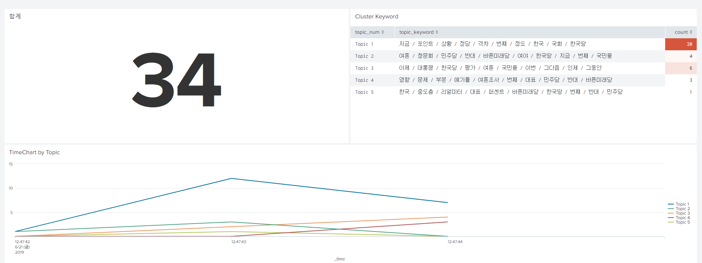
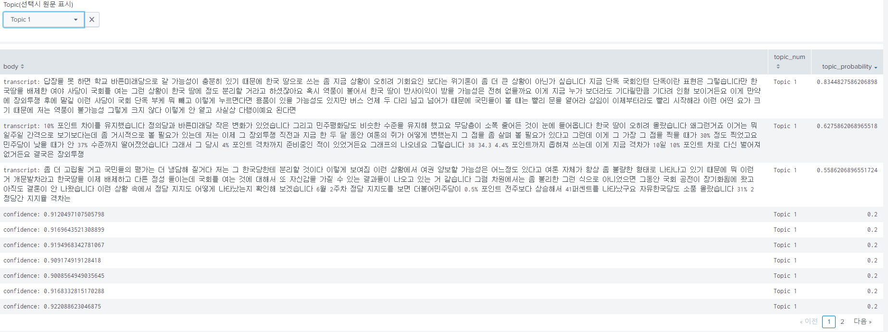
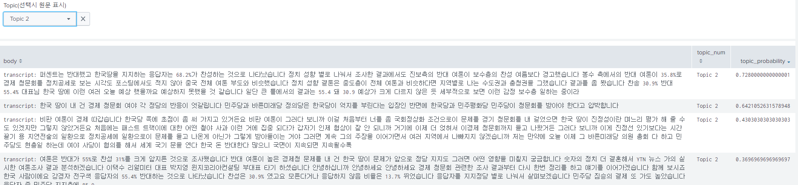
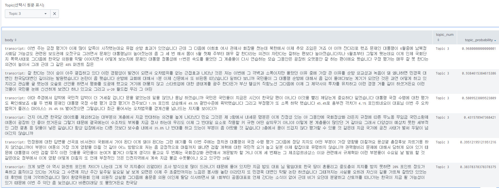
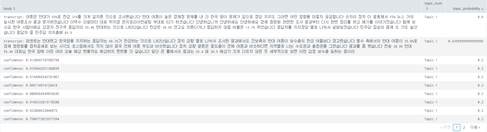

# Voice Magic

KAIT AI BM전문가 과정 "Voice Magic" 팀의 프로젝트 코드 공유를 위한 Repository 입니다.

## Google Cloud Speech-to-Text 변환 및 화자 분할 분석

1. 오디오 파일은 FLAC, LINEAR16(WAV) 등 몇 가지 타입만 지원 합니다.
2. Streaming 방식은 긴 오디오 파일에 대해서도 빠른 응답을 받을 수 있지만, 10M 파일 사이즈 제한이 있습니다. ([2.google_streaming.ipynb](2.google_streaming.ipynb) 참조)
3. Google Cloud Storage를 이용한 Long_Running 방식은 10M 이상의 긴 오디오 파일도 처리 할 수 있지만, 응답시간이 길고, Timeout이 발생할 수 있습니다. ([3.google_long_running_with_gcs](3.google_long_running_with_gcs) 참조)
4. 화자 분리는 en-US, en-IN, es-ES 언어 만 지원합니다. ([4.google_speaker_diarization_english.ipynb](4.google_speaker_diarization_english.ipynb) 참조)
5. 2019.6월 현재 시점에 긴 오디오의 한국어 음성에 사용 가능한 솔루션은 Long_Running 방식(위 3번 항목) 입니다. (**화자 분할은 지원 안됨**)
6. 10M 이상의 긴 오디어 파일을 Streaming 방식으로 처리하기 위해, 오디오 파일을 10M 이하로 잘라서 처리하는 샘플 파일을 "[7.google_streaming_with_long_audio.ipynb](7.google_streaming_with_long_audio.ipynb)"에 작성 하였습니다. (결과를 text 파일로 저장하는 기능 포함)

### Config 속성 : google.cloud.speech.types.RecognitionConfig()

- encoding : 오디오 인코딩 방식(LINEAR16, FLAC 등), ([참고자료 Link](https://cloud.google.com/speech-to-text/docs/encoding?hl=ko))
- sample_rate_hertz : 오디오 샘플링 Rate(8000, 16000, 44100, 48000 등) ([참고자료 Link](https://ko.wikipedia.org/wiki/샘플링_레이트))
- language_code : 언어 코드 (한국어: 'ko-KR', 영어: en-US)
- enable_automatic_punctuation : 구두점(punctuation) 자동 추가(True or False)
- enable_word_time_offsets : 단어별 시작/종료 시간 정보(True or False)
- enable_speaker_diarization : 화자 분할 여부(True or False)
- diarization_speaker_count : 화자 분할 시 화자 숫자
- model : 텍스트 변환 모델(video, phone_call, command_and_search, default) 선택 ([참고자료 Link](https://cloud.google.com/speech-to-text/docs/transcription-model))

## 음성 어조 분석(감성 분석) : Vokaturi API

- Neutral, Happy, Sad, Angry, Fear 5가지 감정에 대한 확률 분석 결과 제공
- 언어에 관계없이 음성의 어조로 분석 가능(한국어도 분석 가능) 하지만, 정확성에 대한 검토 필요함

## NLP 분석 : TakeView

