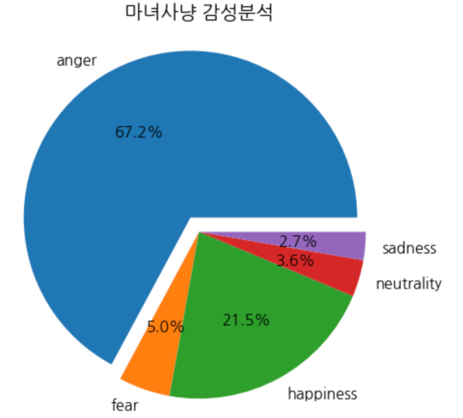
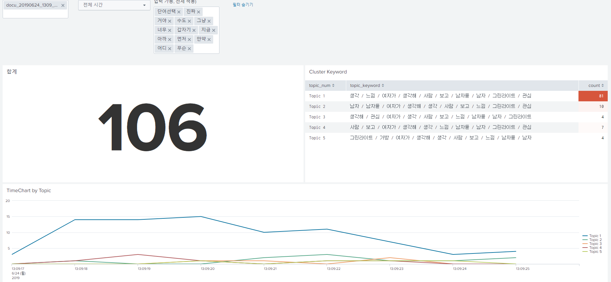
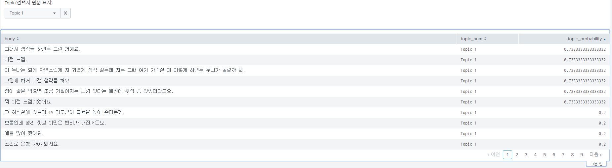
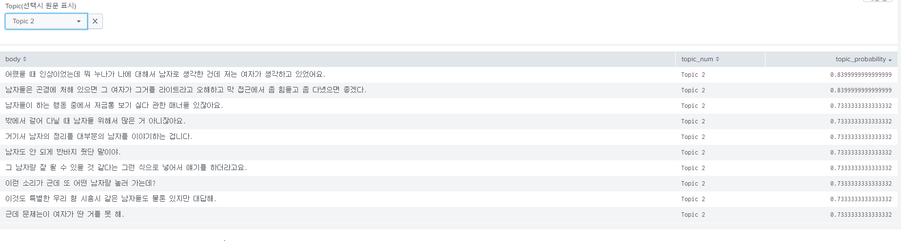
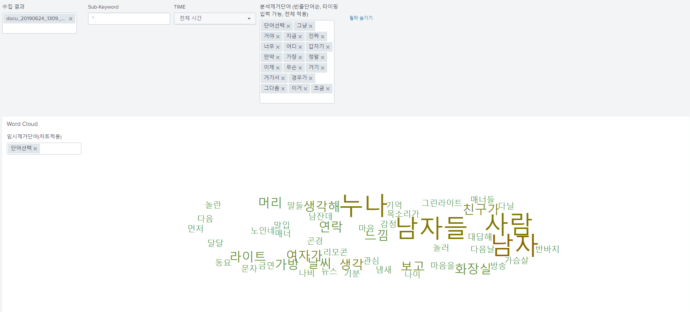
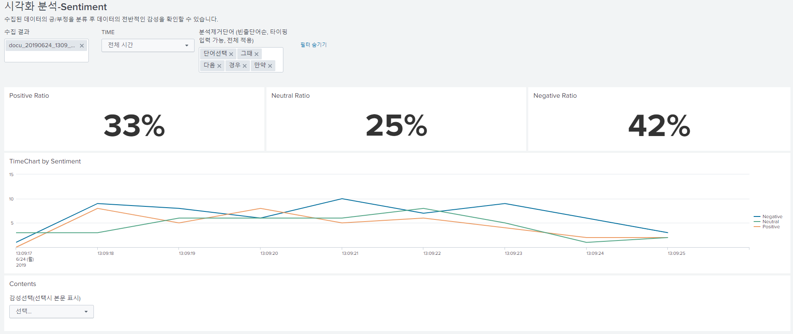

# Voice Magic

KAIT AI BM전문가 과정 "Voice Magic" 팀의 프로젝트 코드 공유를 위한 Repository 입니다.

## Google Cloud Speech-to-Text 변환 및 화자 분할 분석

1. 오디오 파일은 FLAC, LINEAR16(WAV) 등 몇 가지 타입만 지원 합니다.
2. Streaming 방식은 긴 오디오 파일에 대해서도 빠른 응답을 받을 수 있지만, 10M 파일 사이즈 제한이 있습니다. ([2.google_streaming.ipynb](2.google_streaming.ipynb) 참조)
3. Google Cloud Storage를 이용한 Long_Running 방식은 10M 이상의 긴 오디오 파일도 처리 할 수 있지만, 응답시간이 길고, Timeout이 발생할 수 있습니다. ([3.google_long_running_with_gcs](3.google_long_running_with_gcs) 참조)
4. 화자 분리는 en-US, en-IN, es-ES 언어 만 지원합니다. ([4.google_speaker_diarization_english.ipynb](4.google_speaker_diarization_english.ipynb) 참조)
5. 2019.6월 현재 시점에 Google STT에서 지원하는 긴 오디오의 한국어 음성에 사용 가능한 솔루션은 Long_Running 방식(위 3번 항목) 입니다. (**화자 분할은 지원 안됨**)
6. 10M 이상의 긴 오디어 파일을 Streaming 방식으로 처리하기 위해서는, 오디오 파일을 10M 이하로 잘라서 처리하는 방법이 있습니다. ([7.google_streaming_with_long_audio.ipynb](7.google_streaming_with_long_audio.ipynb) 참조, 결과를 text 파일로 저장하는 기능 포함)
7. Microphone Streaming API를 이용해서, 긴 파일을 실시간 Streaming 방식으로 처리하는 방법은 [8.google_streaming_with_microphone_emulate.ipynb](8.google_streaming_with_microphone_emulate.ipynb) 파일과 [modules/google_stt.py](modules/google_stt.py) 코드를 참고하세요.

### Config 속성 : google.cloud.speech.types.RecognitionConfig()

- encoding : 오디오 인코딩 방식(LINEAR16, FLAC 등), ([참고자료 Link](https://cloud.google.com/speech-to-text/docs/encoding?hl=ko))
- sample_rate_hertz : 오디오 샘플링 Rate(8000, 16000, 44100, 48000 등) ([참고자료 Link](https://ko.wikipedia.org/wiki/샘플링_레이트))
- language_code : 언어 코드 (한국어: 'ko-KR', 영어: en-US)
- enable_automatic_punctuation : 구두점(punctuation) 자동 추가(True or False)
- enable_word_time_offsets : 단어별 시작/종료 시간 정보(True or False)
- enable_speaker_diarization : 화자 분할 여부(True or False)
- diarization_speaker_count : 화자 분할 시 화자 숫자
- model : 텍스트 변환 모델(video, phone_call, command_and_search, default) 선택 ([참고자료 Link](https://cloud.google.com/speech-to-text/docs/transcription-model))

## 음성 어조 분석(감성 분석) : Vokaturi API

- Neutral, Happy, Sad, Angry, Fear 5가지 감정에 대한 확률 분석 결과 제공
- 언어에 관계없이 음성의 어조로 분석 가능(한국어도 분석 가능) 하지만, 정확성에 대한 검토 필요함

## NLP 분석 : TakeView

- Cluster Keywords

- Topic1

- Topic2

- Word Cloud

- Sentiment

## 코드 파일에 대한 설명

코드 파일을 실행하기 위해서는 Google Speech-to-Text API 개발환경설정이 필요 합니다. ("google cloud speech-to-text 개발환경 설정하기.pdf" 파일 참고)

- [1.google_quickstart.ipynb](1.google_quickstart.ipynb), [1.google_quickstart.py](1.google_quickstart.py) : Google Cloud Speech-to-Text API Quick-Start example
- [2.google_streaming.ipynb](2.google_streaming.ipynb), [2.google_streaming.py](2.google_streaming.py) : Google Cloud Speech-to-Text API Streaming example
- [3.google_long_running_with_gcs.ipynb](3.google_long_running_with_gcs.ipynb), [3.google_long_running_with_gcs.py](3.google_long_running_with_gcs.py) : 긴 오디오 파일을 비동기 방식으로 처리하는 샘플(오디오 파일은 Google Cloud Storage에 업로드 후 사용 => 오디오 파일 크기 제한은 없으나, 전체 파일을 모두 변환 후 응답을 받을 수 있음)
  - Google Cloud Storage 설정 방법 참고 : [https://cloud.google.com/storage/docs/quickstart-console](https://cloud.google.com/storage/docs/quickstart-console)
- [4.google_speaker_diarization_english.ipynb](4.google_speaker_diarization_english.ipynb), [4.google_speaker_diarization_english.py](4.google_speaker_diarization_english.py) : Google Cloud Speech-to-Text API 화자 분리 샘플(English only)
- [5-google_long_running_with_gcs-sentence_reconstruction.ipynb](5-google_long_running_with_gcs-sentence_reconstruction.ipynb) : 위의 3번 파일에 Transcript를 구두점 기준으로 문장을 나누는 Sentence tokenize 기능 추가
- [6.etri_asr.ipynb](6.etri_asr.ipynb), [6.etri_asr.py](6.etri_asr.py) : ETRI Open API(음성인식) 샘플 코드
  - 가이드 문서 참조 : [http://aiopen.etri.re.kr/guide_recognition.php](http://aiopen.etri.re.kr/guide_recognition.php)
- [7.google_streaming_with_long_audio.ipynb](7.google_streaming_with_long_audio.ipynb) : 위의 2번 항목의 코드(Streaming 방식)는 10M 이하의 파일 만 처리하도록 하는 API 제한사항이 있어서, 10M 이상의 파일을 10M 이하로 자르면서 Streaming 하도록 개선한 샘플
- [8.google_streaming_with_microphone_emulate.ipynb](8.google_streaming_with_microphone_emulate.ipynb) : Google Cloud Speech-to-Text API Microphone Streaming emulate sample
  - Microphone 오디오 파일을 Streaming 방식으로 처리하는 샘플(실제는 저장된 오디오 파일을 읽어서 Streaming 방식으로 처리)
  - 참고 : [https://cloud.google.com/speech-to-text/docs/streaming-recognize?hl=ko#speech-streaming-mic-recognize-python](https://cloud.google.com/speech-to-text/docs/streaming-recognize?hl=ko#speech-streaming-mic-recognize-python)
  - Microphone Streaming 오디오 처리는 300초 시간 제한이 있음 : 더 긴 파일은 파일을 잘라서 처리하도록 개선한 샘플임  
  (OutOfRange: 400 Exceeded maximum allowed stream duration of 305 seconds.)
- [nlp_functions_test.ipynb](nlp_functions_test.ipynb) : Google STT로 변환한 Transcript에 자연어처리(NLP) 기법(TF-IDF)을 이용하여, 자연어 검색, WordCloud, K-Means Clustering을 구현한 샘플
- [streaming_audio_with_pyaudio.ipynb](streaming_audio_with_pyaudio.ipynb), [streaming_audio_with_pyaudio.py](streaming_audio_with_pyaudio.py) : Audio Stream 처리를 위해 Python pyaudio, wave 모듈을 사용하는 샘플(오디오를 읽어서 Play 하는 가장 기본 코드)
- [VokaturiAPI.ipynb](VokaturiAPI.ipynb) : 음성으로 부터 어조를 분석하여 감성분석 결과를 출력해주는 Vokaturi 라이브러리를 이용하는 샘플
  - 참고 : [https://developers.vokaturi.com/getting-started/overview](https://developers.vokaturi.com/getting-started/overview)
- [modules/google_stt.py](modules/google_stt.py) : Google Speech-to-Text API를 이용하기 위한 Functions (샘플 코드에 있는 기능들을 모듈로 만들었음)
- [modules/info_retrieval.py](modules/info_retrieval.py) : 자연어 처리(특히, Information Retrival)에 사용되는 Functions (TF-IDF, Cosine Similarity, Euclidian Distance 등)
- [modules/ngram.py](modules/ngram.py) : N-Gram 언어 모델 Functions(음절 N-Gram, 어절 N-Gram)
